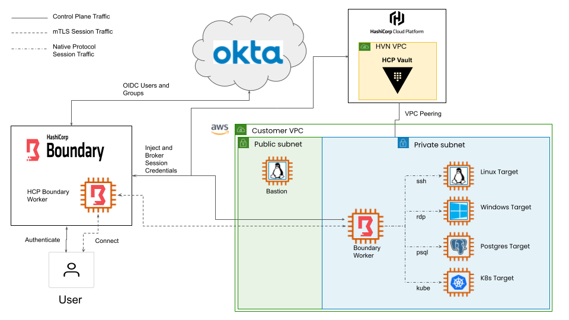

# Boundary Demo

## Demo Environment
This terraform code builds an HCP Boundary enviroment that inclues connectivity to HCP Vault for credential brokering and injection, Okta integration for OIDC authentication and managed groups, and a number of AWS resources that are used as workers and Boundary targets.  

### Boundary Organization Structure

### Demo Environment Diagram

### Components
| Component | Purpose |
| ----------- | ----------- |
| HCP Boundary | Boundary Control Plane |
| HCP Vault | Boundary Credential Store |
| Boundary Worker | Boundary EC2 Worker |
| Okta | OIDC Authentication |
| EKS Cluster | K8s Target |
| EC2 Linux Instance | SSH Cert Auth Target |
| RDS Postgres Database | Database Target |
| EC2 Windows Instance | RDP Target |

## Setup
### Workspaces and Variables
This repo was build to run on Terraform Cloud/Enterprise.  It uses the tfe_outputs data source to pass parameters from the init module to the build module.  If you want to run this locally you will need to modify the code to use cross state sharing to populate those values.  Additionally, you will need to update or remote the cloud provider block to match your Terraform configuration. 

This repo consists of two modules:
 
**boundary-demo-init** - This module builds an HCP Boundary Cluster and HCP Vault Cluster along with an associated HVN for the Vault Cluster.  
**boundary-demo-eks** - This module does the bulk of the work, building out all of the Boundary and Vault configuration as well as the AWS components used as workers and targets.

#### boundary-demo-init
| Variable | Type | Purpose |
| --------- | -------- | -------- |
| boundary_user | terraform | The user name you would like to use for the default admin user created in the HCP Boundary Cluster |
| boundary_password | terraform | The password you would like to use for the default admin user created in the HCP Boundary Cluster |
| HCP_CLIENT_ID | environment | The Client ID used to authenticate to HCP |
| HCP_CLIENT_SECRET | environment | The Secret Key used to authenticate to HCP |

#### boundary-demo-eks
| Variable | Type | Purpose |
| --------- | -------- | -------- |
| region | terraform | The AWS region to deploy worker and targets into |
| boundary_user | terraform | The Boundary admin user that will be set in the provider | 
| boundary_password | terraform | The Boundary admin user password that will be set in the provider |
| db_user | terraform | The username to set on the Postgres database Boundary target |
| db_user | terraform | The password to set on the Postgres database Boundary target |
| okta_baseurl | terraform | The base url for the Okta organization used for OIDC integration.  Probably okta.com |
| okta_org_name | terraform | The organization name for the Okta organization use for OIDC integration i.e. dev-32201783 |
| HCP_CLIENT_ID | environment | The Client ID used to authenticate the HCP provider |
| HCP_CLIENT_SECRET | environment | The Secret Key used to authenticate the HCP provider |
| OKTA_API_TOKEN | environment | The token used to authenticate the Okta provider |
| TFE_TOKEN | environment | The token used to authenticate the Terraform provider to use the tfe_outputs data source |
| AWS_ACCESS_KEY_ID | environment | The AWS Access Key used to authenticate the AWS provider |
| AWS_SECRET_ACCESS_KEY | environment | The AWS Secret Key used to authenticate the AWS provider |

**Note**: If you do not wish to use the Okta integration you can simply rename or delete the okta.tf configuration file.  All of the Okta related configuration is contained within the file and the terraform code should still build cleanly without it.  

### To Build
Set the variables to appropriate values and update the cloud block in the providers.tf files in each module as appropriate.  
Init and apply the boundary-demo-init terraform first

`boundary-demo-init % terraform init
boundary-demo-init % terraform apply -auto-approve`

Once the boundary-demo-init run has completed init and apply the boundary-demo-eks terraform

`boundary-demo-eks % terraform init
boundary-demo-eks % terraform apply -auto-approve`

**Notes**: 
- The terraform code is generally stable and completes in a single run but if you experience issues a second run is usually enough to correct them.  
- If for some reason you need to rebuild the EC2 Boundary worker you should also taint the boundary_worker resource as rebuilding the EC2 instance without re-creating the worker in Boundary and getting a new auth key will cause the worker to fail to connect to the Boundary control plane.  

`boundary connect rdp -exec bash -target-id $TARGET_ID -- -c "open rdp://full%20address=s={{boundary.addr}} && sleep 600"`